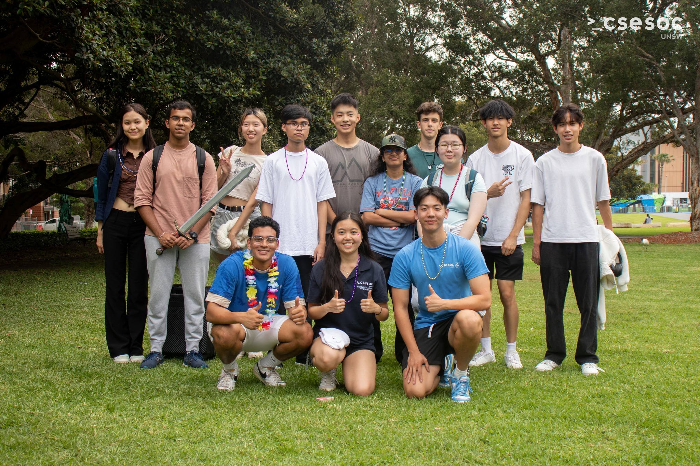
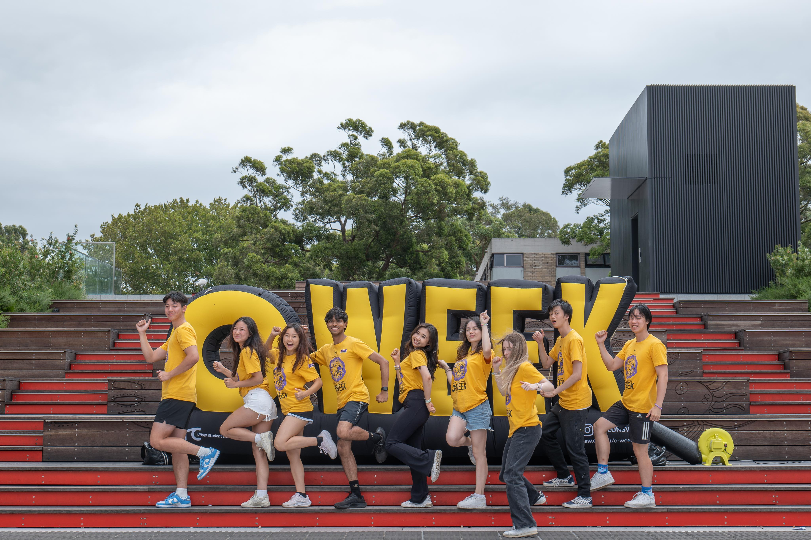
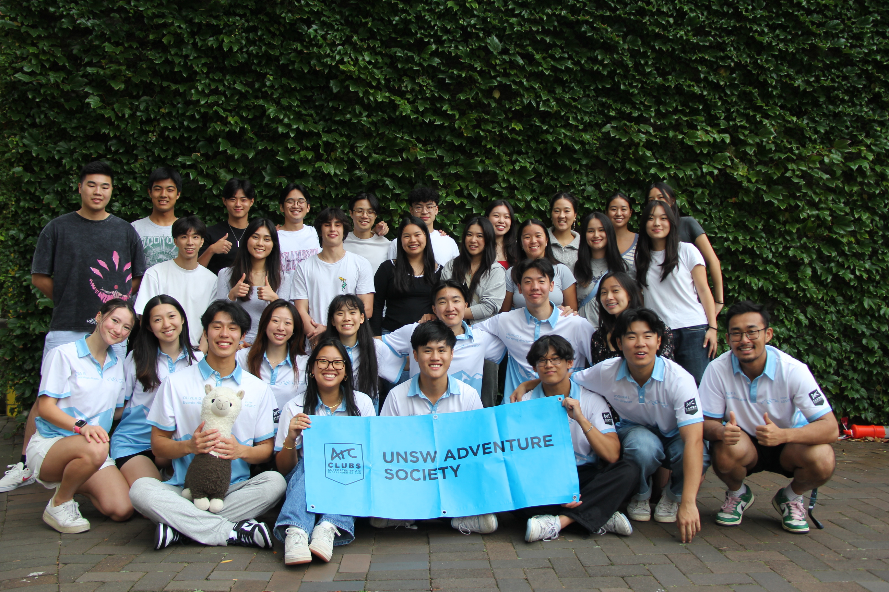
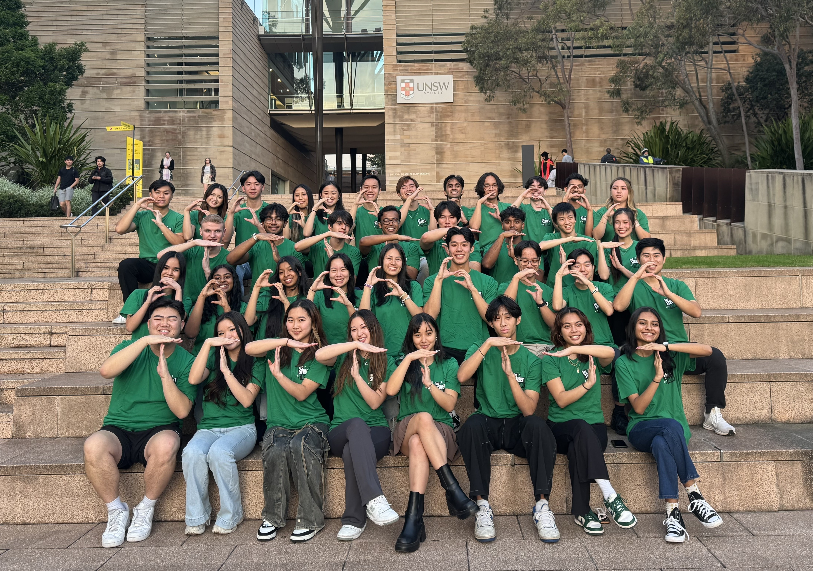

<link rel="stylesheet" href="{{ 'assets/img/css/img.css' | relative_url }}">
<link rel="stylesheet" href="{{ 'stylesheet/textstyle.css' | relative_url }}">
<link rel="stylesheet" href="{{ 'stylesheet/styles.css' | relative_url }}">

  

    Hello, I'm Richard!   
    I'm a final year Computer Science student studying at UNSW, working towards a career in software engineering.  
    Feel free to check out the projects tab to see what I have recently worked on.  
    Outside of tech, I enjoy being a part of various societies and volunteering programs to help bring students together.
  

  
  
    
  

  
 
    
CSEsoc First Year Camp Leader

  

  
 
    
Yellow Shirt O-Week Volunteer

  

  
  
    
  

  
  
    
  

  
 
    
Adventure Society VPO (Vice President of Operations)

  

  
 
    
Street Team Senior Volunteer

  

  
  
    
  

[install]: install.md
[upgrade]: upgrade.md
[config]: config.md
[basics]: basics.md
[writing]: writing.md
[scripts]: scripts.md
[build]: build.md
[advanced]: advanced.md
[LICENSE]: ../LICENSE.md
[NOTICE]: ../NOTICE.md
[CHANGELOG]: ../CHANGELOG.md
