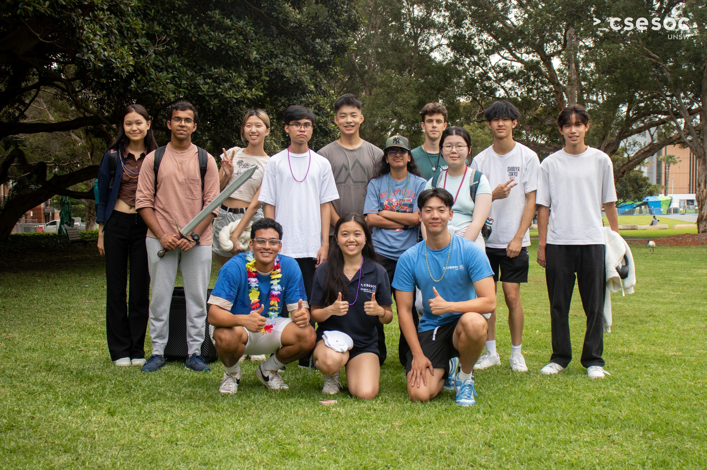
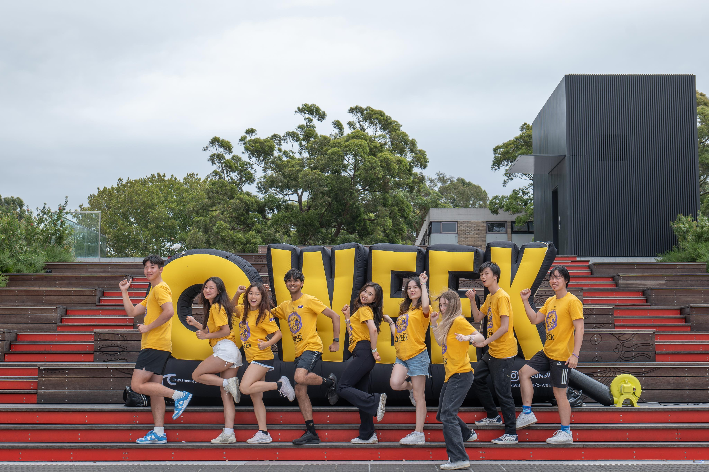
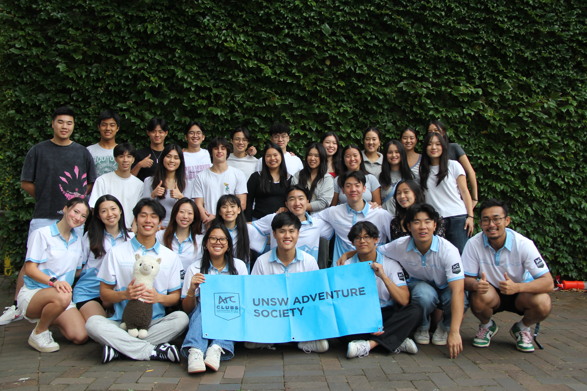
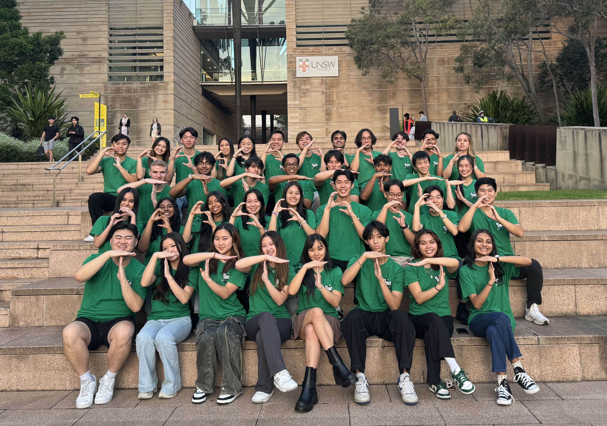

<link rel="stylesheet" href="{{ 'assets/img/css/img.css' | relative_url }}">
<link rel="stylesheet" href="{{ 'stylesheet/textstyle.css' | relative_url }}">
<link rel="stylesheet" href="{{ 'stylesheet/styles.css' | relative_url }}">

  
Leadership, Teamwork & Communication

  

Throughout university, I actively participated in student societies and volunteering initiatives, challenging myself to step into leadership roles and help guide other students. Being able to give back to the community and support others was one of the most rewarding parts of my university experience.

  

  
 
    
Notable Experiences

  

    

      
  
        
      

      
 
        
CSEsoc First Year Camp Leader

        
Mentored first-year Computer Science students and helped them transition into university. Facilitated group activities and bonding events, developing strong communication, leadership, and teamwork skills while contributing to a positive and inclusive community.

      

    

    

      
 
        
Yellow Shirt O-Week  Return Volunteer

        
Collaborated with 200+ volunteers to deliver UNSW O-Week, one of the largest university orientation events in the Southern Hemisphere. Assisted new students by answering inquiries, leading campus tours, and promoting various university events.
        

      

      
  
        
      

    

    

      
  
        
      

      
 
        
Adventure Society VPO (Vice President of Operations)

        
Worked with the executive team to oversee society operations, managing a 40+ member internal team of directors and subcommittees and a community of 700+ society members. Directed marketing operations which includes managing social media, upskilling marketing members, and guiding merchandise initiatives. Solely responsible for maintaining and updating the society website, making revisions where possible to future-proof it for non-technical successors.

      

    

    

      
 
        
Street Team Senior Volunteer

        
Collaborated with 40+ volunteers to deliver weekly stalls promoting student life through initiatives such as interactive games, giveaways, and themed events. Helped foster a welcoming and inclusive environment by actively supporting Arc UNSW’s principles of Equity, Diversity, and Inclusion (EDI), contributing to culturally themed events and positive campus experiences.

      

      
  
        
      

    

  

  
  

    <button class="carousel-btn carousel-prev">❮</button>
    

      <button type="button" class="carousel-dot active" onclick="goToSlide(0)" aria-label="Go to slide 1"></button>
      <button type="button" class="carousel-dot" onclick="goToSlide(1)" aria-label="Go to slide 2"></button>
      <button type="button" class="carousel-dot" onclick="goToSlide(2)" aria-label="Go to slide 3"></button>
      <button type="button" class="carousel-dot" onclick="goToSlide(3)" aria-label="Go to slide 4"></button>
    

    <button class="carousel-btn carousel-next">❯</button>
  

  
Initiative & Creativity

  

I've always been intrigued by sneakers, fashion, and collectibles because they bring together creativity, character, and community. Over time, I saw an opportunity to turn that interest into something more meaningful by <strong>starting my own e-commerce project</strong> focused on sourcing high-demand products for enthusiasts like myself. What began as a hobby sourcing and reselling sneakers has grown into designing original products, managing online platforms, and creating content around my brand, ARCA.

  

Through ARCA, I've worked directly with customers and collaborators while managing branding, fulfilment, and digital storefronts. <strong>Leading these efforts developed my communication and problem-solving skills with a customer first mindset</strong>.

  

    <a href="https://www.arcacollab1.com/about-us" target="_blank" rel="noopener noreferrer" class="split-image-link">
      

        

        

        

      

    </a>
  

[install]: install.md
[upgrade]: upgrade.md
[config]: config.md
[basics]: basics.md
[writing]: writing.md
[scripts]: scripts.md
[build]: build.md
[advanced]: advanced.md
[LICENSE]: ../LICENSE.md
[NOTICE]: ../NOTICE.md
[CHANGELOG]: ../CHANGELOG.md
