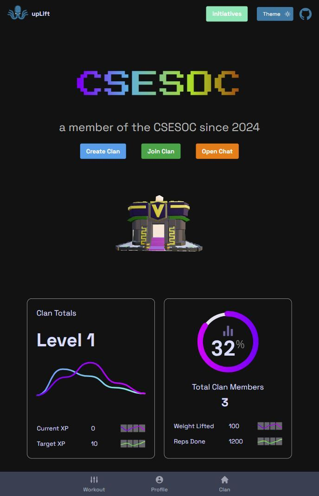
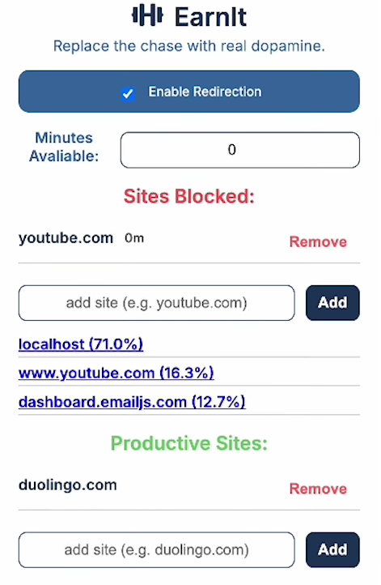
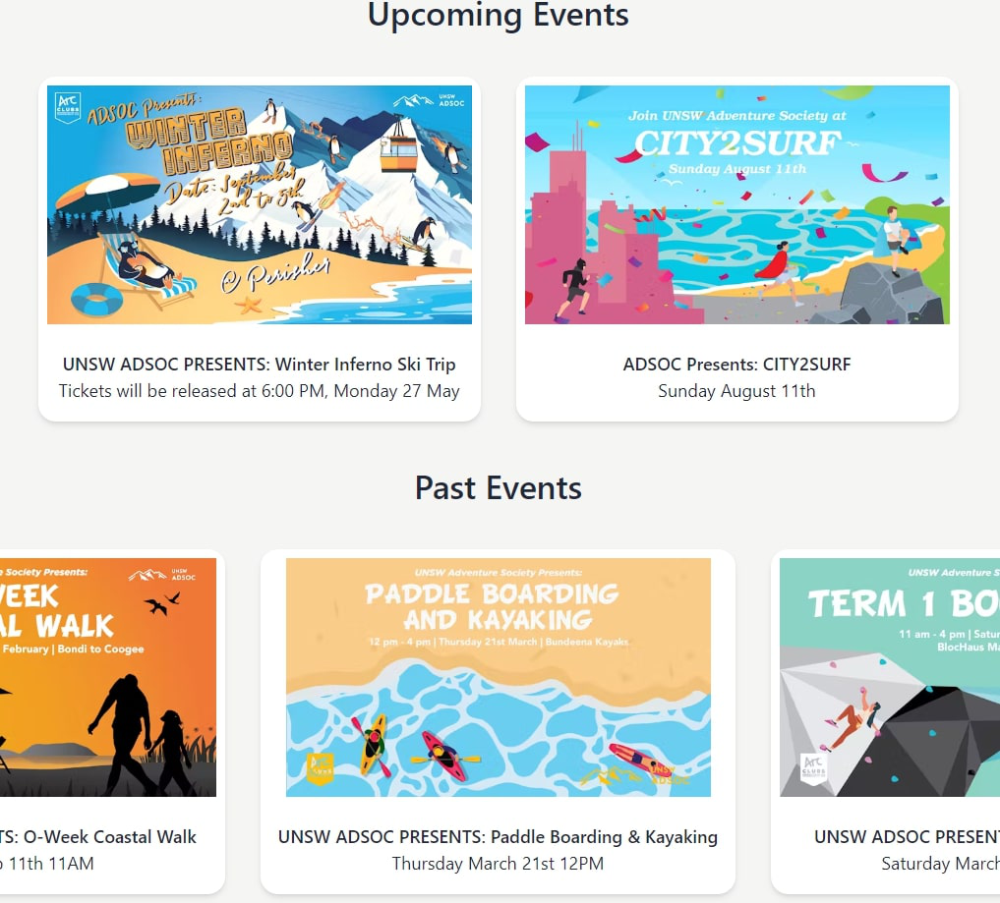
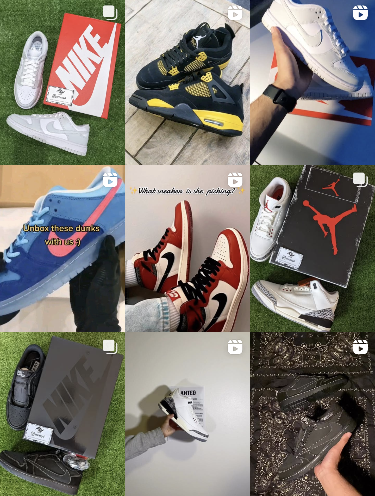

<!-- <link rel="stylesheet" href="{{ 'assets/img/css/img.css' | relative_url }}"> -->
<link rel="stylesheet" href="{{ 'stylesheet/project_styles.css' | relative_url }}">
<link rel="stylesheet" href="{{ 'assets/img/css/img.css' | relative_url }}">
<link rel="stylesheet" href="{{ 'stylesheet/textstyle.css' | relative_url }}">
<!-- <link rel="stylesheet" href="{{ 'stylesheet/styles.css' | relative_url }}"> -->

<!--author-->

    <a href="https://devpost.com/software/uplift-bi4quj" target="_blank" class="project-link">
      

          

              <h3 class="project-category">UpLift</h3>
              <h2 class="project-title">Social web app that motivates users to achieve their personalized health goals through gamified progress tracking and community accountability.</h2>
          

          

              
          

      

    </a>
    <a href="https://devpost.com/software/uplift-bi4quj" target="_blank" class="project-link">
        

        

            <h3 class="project-category">EarnIt</h3>
            <h2 class="project-title">Chrome extension that utilizes TensorFlow MoveNet to ensure users complete productive challenges to temporarily unlock user-blocked websites.</h2>
        

        

            
        

    

    </a>
    <a href="https://www.unswadsoc.com/" target="_blank" class="project-link">
    

        

            <h3 class="project-category">ADSOC</h3>
            <h2 class="project-title">Dynamic website for UNSW Adventure Society, showcasing events, memberships and sponsorships.</h2>
        

        

            
        

    

    </a>
        <a href="https://www.instagram.com/arcasyd/" target="_blank" class="project-link">
    

        

            <h3 class="project-category">Arcasyd (In-progress)</h3>
            <h2 class="project-title">E-commerce website for personal retail arbitrage business surrounding limited sneakers, apparel and collectibles.</h2>
        

        

            
        

    

    </a>

<!-- 

  
  
    
    
 
      
CSEsoc First Year Camp Leader

    

  

<!-- 

  

 -->
<!-- 

  

 -->
